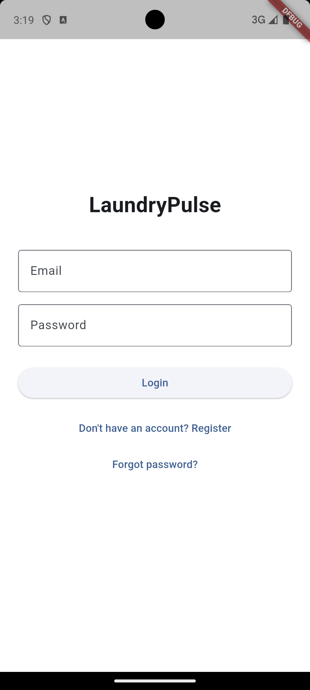
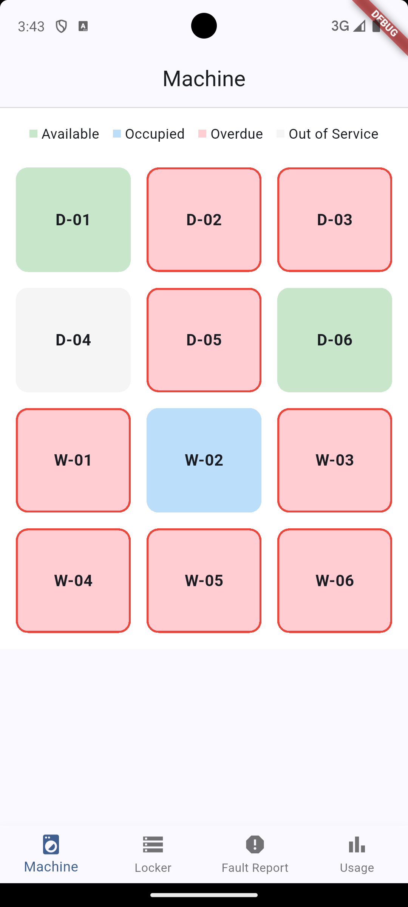
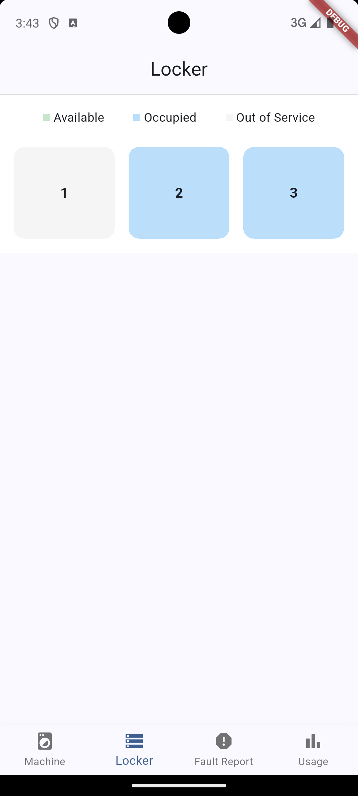
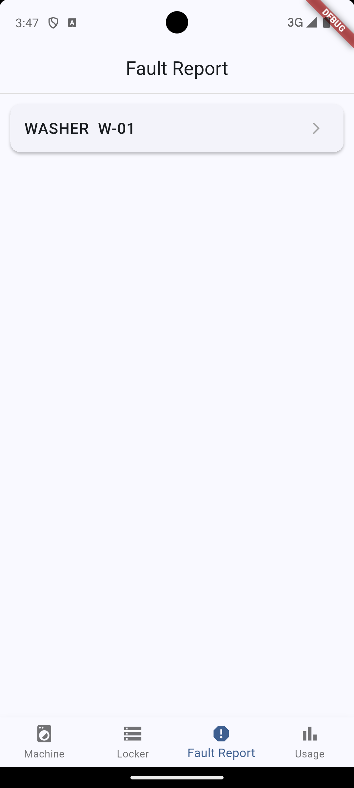
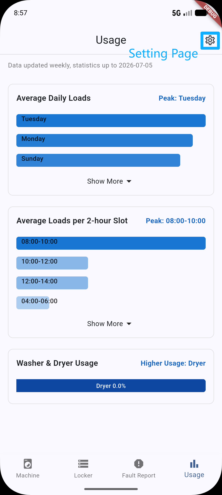
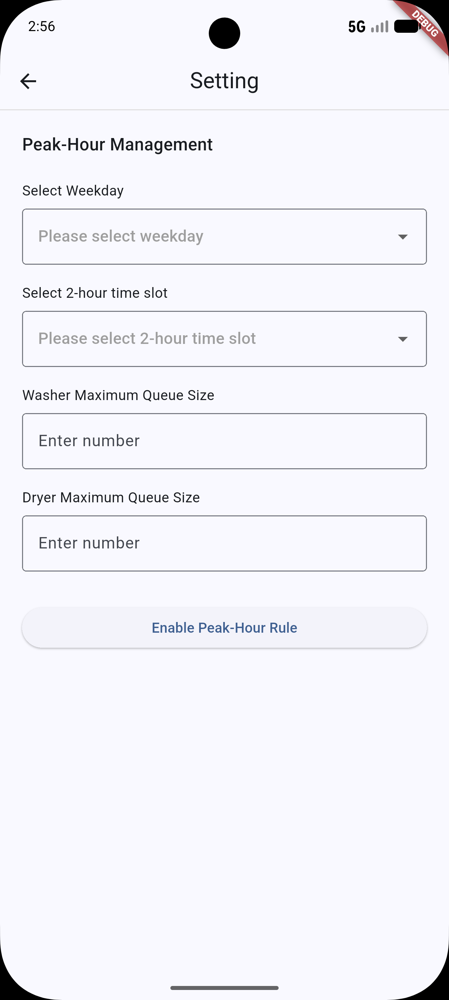

# LaundryPulse — Admin Guide

A guide for **maintenance staff / administrators** who manage machines, lockers, and fault reports in LaundryPulse.

> **Screenshots:** Placeholders like `` mark where a screenshot should go. Capture each screen and save it to `docs/screenshots/`.

---

## Table of Contents

1. [Signing In as an Admin](#1-signing-in-as-an-admin)
2. [Dashboard Overview](#2-dashboard-overview)
3. [Machine Tab — Take Offline / Restore](#3-machine-tab)
4. [Locker Tab — Take Offline / Restore](#4-locker-tab)
5. [Fault Report Tab — Handle Reports](#5-fault-report-tab)
6. [Usage Tab — Room Analytics](#6-usage-tab)
7. [Notes & Known Limitations](#7-notes--known-limitations)

---

## 1. Signing In as an Admin

Admins use the **same login screen** as residents. An account's **role** is what routes you to the admin dashboard.

1. Open the app and enter your **admin** email and password.
2. Tap **Login**.
3. Because your account role is `admin`, you're taken straight to the **Admin dashboard** (regular users go to the resident Home screen instead).

> Admin accounts are provisioned in the backend/database — there is no in-app way to promote a normal user to admin.

---

## 2. Dashboard Overview

The admin dashboard has a bottom navigation bar with **four tabs**, plus a settings icon in the top bar.

| Tab | Purpose |
|---|---|
| 🧺 **Machine** | View all washers/dryers; take a machine offline or restore it |
| 🗄 **Locker** | View all lockers; take a locker offline or restore it |
| 📋 **Fault Report** | Review user-submitted fault reports and mark them fixed |
| 📊 **Usage** | Room-wide usage analytics (daily / hourly / per-machine) |

All status views **auto-refresh every 5 seconds**.

> The settings (gear) icon opens a **Setting** page that is currently a placeholder (no options yet).

---

## 3. Machine Tab

Shows every machine as a coloured tile with a status legend.

| Colour | Status |
|---|---|
| 🟩 Green | Available |
| 🟦 Blue | Occupied |
| 🟥 Red (red border) | Overdue |
| ⬜ Grey | Out of Service |

### Take a machine offline

1. Tap any machine that is **not** already out of service.
2. A **Device Shutdown** dialog appears:
   *"Confirm to mark machine W-03 as outOfService. All users will receive push notifications."*
3. Tap **Confirm Shutdown**. The machine turns grey and **all users get a push notification**.

### Restore a machine

1. Tap a machine that is **Out of Service** (grey).
2. A **Restore Machine** dialog appears.
3. Tap **Confirm Restore**. The machine returns to **Available**.

> Taking a machine offline is intended for maintenance/breakdowns. Users can no longer select it until you restore it.

---

## 4. Locker Tab

Works exactly like the Machine tab, for lockers.

| Colour | Status |
|---|---|
| 🟩 Green | Available |
| 🟦 Blue | Occupied |
| ⬜ Grey | Out of Service |

- **Take offline:** tap an in-service locker → **Locker Shutdown** dialog → **Confirm Shutdown** (users are notified).
- **Restore:** tap an out-of-service locker → **Restore Locker** dialog → **Confirm Restore**.

---

## 5. Fault Report Tab

Lists fault reports submitted by residents (broken washer / dryer / locker).

Each entry shows the **facility type + number** (e.g. `WASHER W-02`) and the reported description.

- Tap **Mark Fixed** to close a report once the issue is resolved. You'll see *"Marked as fixed successfully."*
- **Unfixed** leaves the report open.

> If there are no open reports you'll see *"No pending fault records."*

---

## 6. Usage Tab

Room-wide analytics, **updated weekly**. Useful for capacity planning and spotting peak load.

- **Average Daily Loads** — average machines in use per weekday, with a **Peak** day highlighted.
- **Average Loads per 2-hour Slot** — busiest times of day, with a **Peak** slot highlighted.
- **Washer & Dryer Usage** — total usage minutes per machine, with the **highest-usage** machine highlighted.

Each section has a **Show More / Show Less** toggle.

> If there's no booking data before last Sunday, the charts show *"No booking records before last Sunday."*
---

- **Setting Page** — configure and activate **peak‑hour policies**.

  Admins can enable peak‑hour rules by specifying a weekday, 2‑hour time window, and setting upper queue limits for washers and dryers. Two constraints apply within peak hours:

  1. Users are prohibited from queuing for the same machine type until their ongoing laundry of washer or dryer finishes. This rule does not apply during off‑peak time.
  2. Once the waiting queue hits the preset maximum number, subsequent queue requests will be blocked automatically.

## 7. Notes & Known Limitations

- **Two backend URLs:** the app currently talks to two Render backends —
  `https://laundrypulse-gf1v.onrender.com` (main app + machine/locker/usage reads) and
  `https://laundrypulse.onrender.com` (admin shutdown/restore actions, fault list, mark-fixed).
  If admin actions or fault reports appear to fail while the rest of the app works, confirm **both** services are up. Unifying these into one base URL is a known cleanup item.
- **Simulated hardware:** machine and locker status changes are driven by app actions, not physical sensors. In a real deployment, IoT sensors would replace the manual buttons.
- **Admin provisioning** is done in the backend/database; there's no in-app admin-management UI.

---

*For the resident-facing experience, see the [User Guide](USER_GUIDE.md).*
