# LaundryPulse — User Guide

A step-by-step guide to using the **LaundryPulse** app as a resident. This covers everything from creating an account to washing, queueing, helping others, and earning credit.

> **Screenshots:** Placeholders like `` mark where a screenshot should go. Capture each screen from an Android emulator (or device) and save it to `docs/screenshots/` using the filename shown.

---

## Table of Contents

1. [What is LaundryPulse](#1-what-is-laundrypulse)
2. [Getting Started — Register, Log In, Reset Password](#2-getting-started)
3. [The Home Screen — Reading Machine Status](#3-the-home-screen)
4. [Washing / Drying — Full Cycle](#4-washing--drying-full-cycle)
5. [Online Queue](#5-online-queue)
6. [Helping With Overdue Laundry (Lockers)](#6-helping-with-overdue-laundry)
7. [Credit Score](#7-credit-score)
8. [Rating Helpers (Pending Reviews)](#8-rating-helpers-pending-reviews)
9. [Profile & My Laundry Habits](#9-profile--my-laundry-habits)
10. [HeatMap & Off-Peak Suggestions](#10-heatmap--off-peak-suggestions)
11. [Fault Report](#11-fault-report)
12. [Notifications](#12-notifications)
13. [FAQ](#13-faq)

---

## 1. What is LaundryPulse

LaundryPulse is a mobile app for shared hostel laundry rooms. It lets you:

- See which washers and dryers are **available, in use, or overdue** in real time.
- **Start a wash/dry cycle** and get a reminder when it finishes.
- **Join an online queue** when everything is busy, instead of waiting in the room.
- **Help a neighbour** whose laundry is overdue by moving it to a locker — and earn credit for it.
- View **usage heatmaps** and **off-peak suggestions** so you can do laundry when it is quiet.
- **Report a broken machine** to the maintenance team.

> **How machine status works:** In this project, machines don't have physical sensors. Status changes are driven by what users tap in the app (e.g. pressing **Start Washing**). In a real deployment, IoT sensors would do this automatically.

---

## 2. Getting Started

### 2.1 Register

1. Open the app. You land on the **Login** screen.
2. Tap **"Don't have an account? Register"**.
3. Enter your **email** and a **password** (at least **6 characters**).
4. Tap **Register**. On success you are returned to the Login screen.

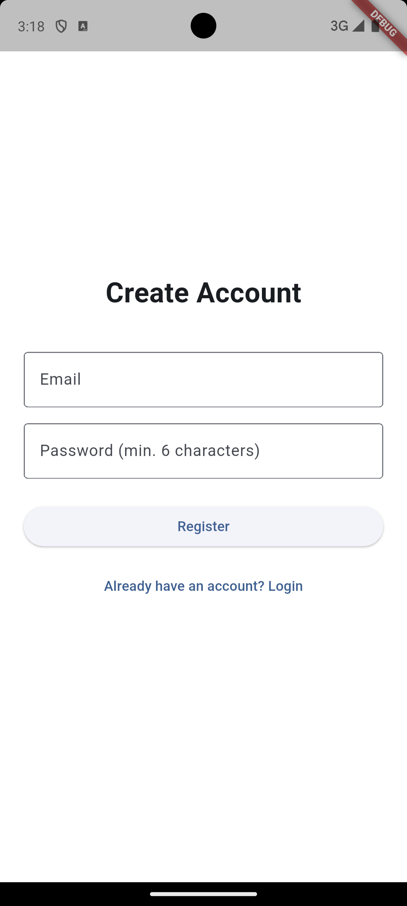

**Validation rules**
- Email must contain `@`.
- Password must be at least 6 characters.
- Every new account starts with a **credit score of 15**.

### 2.2 Log In

1. On the **Login** screen, enter your email and password.
2. Tap **Login**.
3. On success you see a short **Welcome to LaundryPulse** screen and are taken to the Home tab.

> On login the app asks for **notification permission** so it can send you reminders. Allow it to get wash-done and queue alerts.

### 2.3 Reset Password

1. On the Login screen, tap **"Forgot password?"**.
2. Enter your **account email** and a **new password**.
3. Tap **Reset password**. You are returned to Login — sign in with the new password.

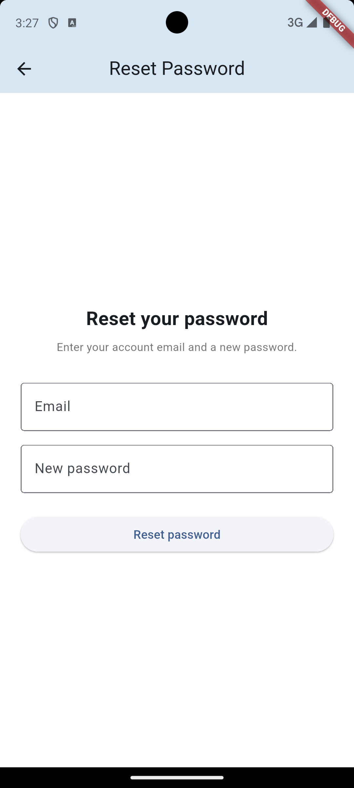

---

## 3. The Home Screen

The Home tab shows every machine in the room as a coloured tile. The bottom navigation bar has four tabs: **Home**, **Queue**, **HeatMap**, **Profile**.

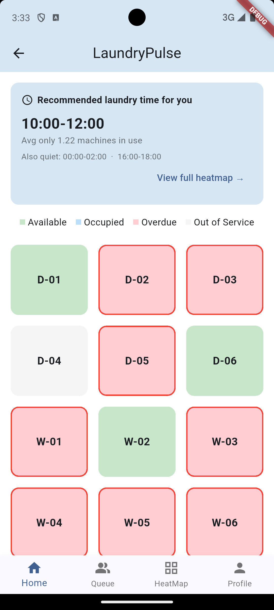

### Status colours

| Colour | Status | Meaning | Tappable? |
|---|---|---|---|
| 🟩 Green | **Available** | Free to use | No |
| 🟦 Blue | **Occupied** | Cycle running or reserved | **Yes** — see remaining time |
| 🟥 Red (red border) | **Overdue** | Cycle finished but not collected within 15 min | **Yes** — offer to help |
| ⬜ Grey | **Out of Service** | Taken offline by an admin | No |

- Tapping an **Occupied** machine opens the **real-time wait / control** page for that machine.
- Tapping an **Overdue** machine opens the **Overdue Handling** page (unless someone is already helping — then you'll see a message at the bottom).
- Available and Out-of-Service tiles are not clickable.

At the top of Home you may also see an **off-peak suggestion card** (see [section 10](#10-heatmap--off-peak-suggestions)).

---

## 4. Washing / Drying — Full Cycle

The steps below are the normal flow once you have a machine reserved (either you picked a free machine through the queue, or you were assigned one).

### 4.1 Start a cycle

1. Tap your **reserved** machine on Home (it shows as Occupied/blue).
2. The machine page shows **"Ready to wash?"** with a **Start Washing** (or **Start Drying**) button.
3. Tap **Start**. You'll be asked to choose a **cycle duration**: **30 / 45 / 60 minutes**.
   - If you've used this machine type before, the app may first offer your **usual duration** — tap **Yes** to reuse it, or **No, choose** to pick manually.
4. **Washers only:** you're then asked **"Need a dryer after washing?"**
   - **Yes** — LaundryPulse will automatically reserve a dryer (or add you to the dryer queue) when your wash finishes.
   - **No** — just wash.
5. The countdown timer starts.

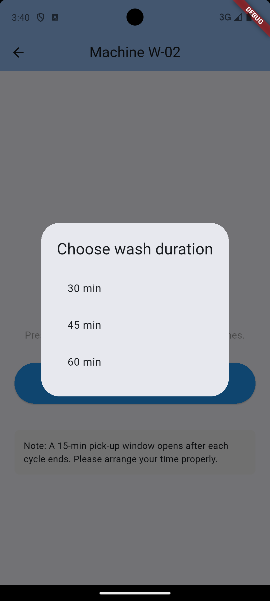

### 4.2 During the cycle

A large circular timer counts down the remaining time. You can leave the page — the timer keeps running on the backend.

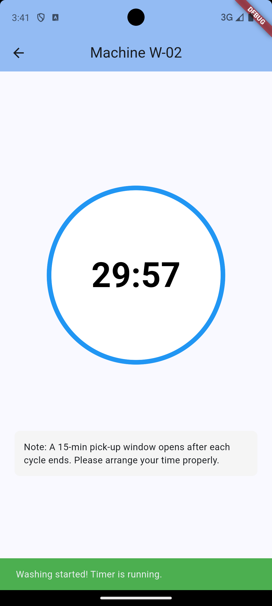

### 4.3 Collect your laundry

1. When the cycle ends you get a **notification**, and the machine page shows **"Washing Done!"**.
2. You have a **15-minute pick-up window**.
3. Tap **Pick Up ✓**. The machine returns to **Available**.

> ⚠️ **If you don't collect within 15 minutes**, the machine becomes **Overdue** and another user may move your laundry to a locker so they can use the machine.

---

## 5. Online Queue

Use the **Queue** tab when machines are busy. Washers and dryers have **separate, independent queues**.

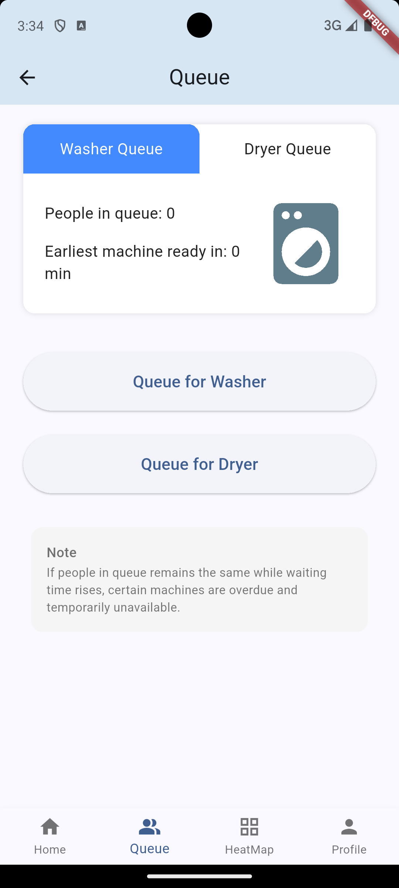

### How it works

1. Choose the **Washer Queue** or **Dryer Queue** tab at the top.
2. You'll see:
   - **People in queue**
   - **Earliest machine ready in ___ min**
   - **People ahead of you** (only if you're already queued)
3. Tap **Queue for Washer** or **Queue for Dryer**.

**Rules**
- You must have a **credit score of 15 or higher** to join a queue. Below that, the request is rejected with a message.
- If an **idle machine of that type exists**, you're immediately assigned the **lowest-numbered** free machine, plus a **15-minute reservation window** to start.
- If **none are free**, you're added to the queue in **FIFO (first-in, first-out)** order. When a machine frees up, the first person in line gets it and receives a **push notification** plus a 15-minute reservation window.
- The **Queue** button is disabled if you're already in that queue.

---

## 6. Helping With Overdue Laundry

When a machine goes **Overdue**, anyone can help by moving the previous user's clothes into an available locker — and earn credit for it.

### Step by step

1. On Home, tap the **Overdue** (red) machine.
   - If someone is already helping, you'll see **"This machine is already being assisted"** and nothing else happens.
2. The **Overdue Handling** page explains the process and the credit rules. Choose:
   - **No** — return to Home, no action taken.
   - **Yes** — start helping. The app assigns you an **available locker** and starts a **15-minute countdown**.
     - If all lockers are full, you'll see *"Locker is full, thank you for your kindness"* and return Home.

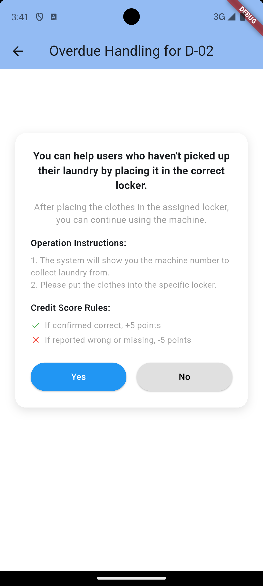

3. On the **Help to Collect** page you're told exactly what to do, e.g. *"Put clothes from W-03 into Locker 5."* Physically move the clothes, then tap **Help To Collect**.
4. A dialog asks **"Would you continue to use this machine?"**
   - **Yes** — the machine is **reserved for you** with a standard 15-minute window; continue with the normal wash flow.
   - **No** — the machine is set back to **Available** for others.

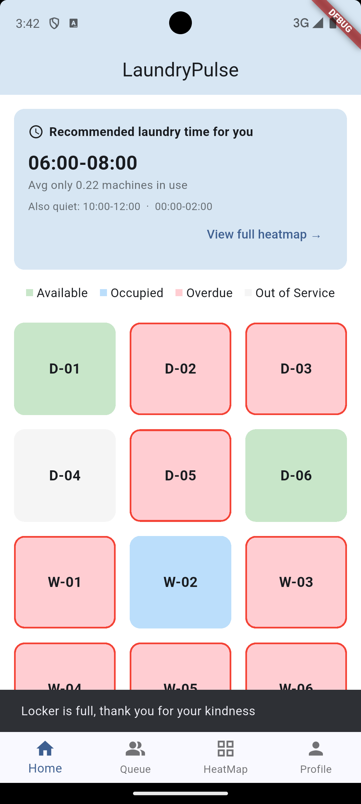

> If you **don't** tap **Help To Collect** within 15 minutes, the page returns to Home automatically, the machine stays Overdue, and no review record is created.

Once you help, the original owner is asked to **rate** whether you placed their clothes correctly (see next section) — that rating decides your credit change.

---

## 7. Credit Score

Your credit score controls whether you can use the online queue.

- Every new user starts at **15**.
- **+5 points** if your help is rated positively (clothes placed correctly, nothing missing).
- **−5 points** if rated negatively (misplaced or missing items).
- **No change** if you decline to help.
- You need **≥ 15** to join a queue.

On the **Profile** tab your score is colour-coded:

| Score | Colour | Meaning |
|---|---|---|
| ≥ 15 | 🟢 Green | Eligible to join queue |
| 10–14 | 🟠 Orange | Below threshold |
| < 10 | 🔴 Red | Below threshold |

> **Why this exists:** overdue machines are locked, and misplacing someone's laundry costs you credit. Together these rules discourage people from moving others' clothes around carelessly.

---

## 8. Rating Helpers (Pending Reviews)

If someone helped move **your** overdue laundry, you decide whether they did it correctly.

1. Go to the **Profile** tab. If you have reviews pending, **"Pending Assistance Records to Review"** shows a red count badge.
2. Tap it to open **Pending Reviews** — a list of records showing the time and machine.
3. Tap a record. A dialog asks: *"Did the helper place items in the correct locker with complete belongings?"*
   - **Yes (+5 Credits)** — the helper gains 5 credits.
   - **No (−5 Credits)** — the helper loses 5 credits.

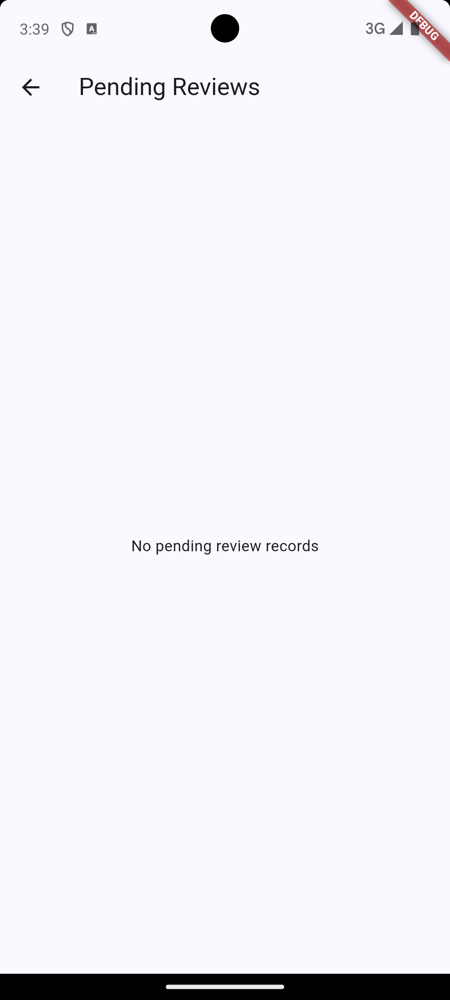

---

## 9. Profile & My Laundry Habits

The **Profile** tab shows your email, credit score, and quick links.

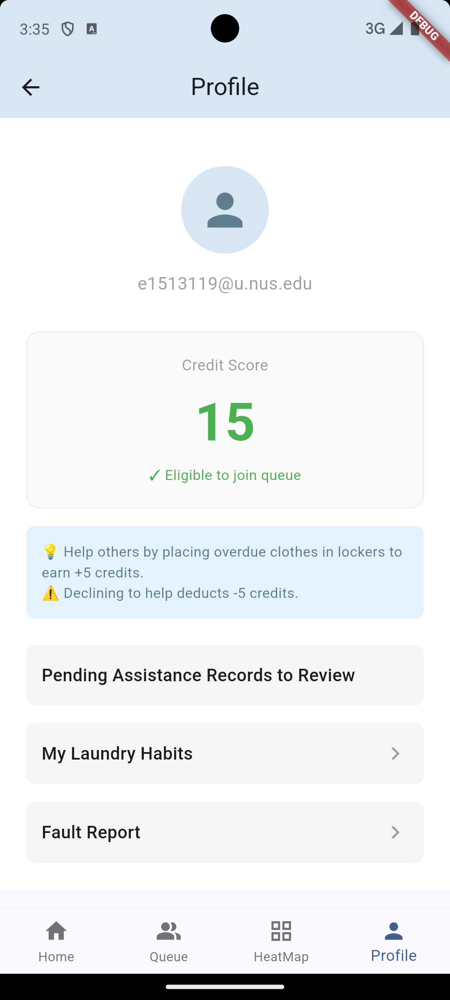

**My Laundry Habits** (tap the entry on Profile) shows your personal usage analytics once you have enough history:

- A summary like *"You usually do 45-min cycles on Fridays around 20:00."*
- Total uses, wash/dry split, and monthly/yearly frequency.
- **Mode Preference** bars (30 / 45 / 60 min).
- **Weekly Pattern** bars (Mon–Sun).

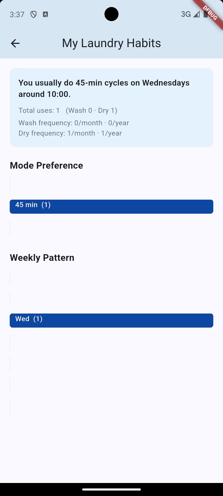

> If you're new, you'll see *"Not enough data yet. Use a machine to start tracking."*

---

## 10. HeatMap & Off-Peak Suggestions

The **HeatMap** tab shows how busy the laundry room usually is, so you can pick a quiet time. Data is **updated weekly**.

- **Average Daily Loads** — busiest days of the week (with a "Peak" label). Tap **Show More** to see all days.
- **Average Loads per 2-hour Slot** — busiest times of day. Tap **Show More** for all slots.

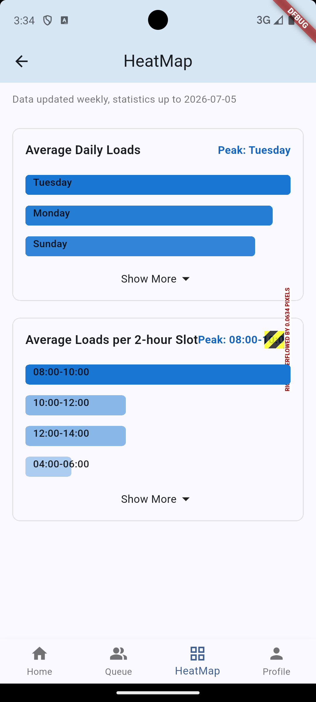

On the **Home** tab, an **off-peak card** highlights the best upcoming quiet window for you (e.g. *"Recommended laundry time for you — 02:00–04:00, avg only 1 machine in use"*). Tap **View full heatmap →** to jump to the HeatMap tab.

---

## 11. Fault Report

Report a broken washer, dryer, or locker to maintenance.

1. Go to **Profile → Fault Report**.
2. Fill in:
   - **Facility Type** — must be lowercase: `washer`, `dryer`, or `locker`.
   - **Facility Number** — format depends on type:
     - Washer: **`W-01` to `W-06`** (capital W, hyphen, two digits)
     - Dryer: **`D-01` to `D-06`**
     - Locker: **digits only** (e.g. `5`)
   - **Facility Description** — describe the problem in detail.
3. Tap **Submit Fault Report**, then confirm **Yes** in the dialog.
4. You'll see *"Fault report submitted successfully!"*

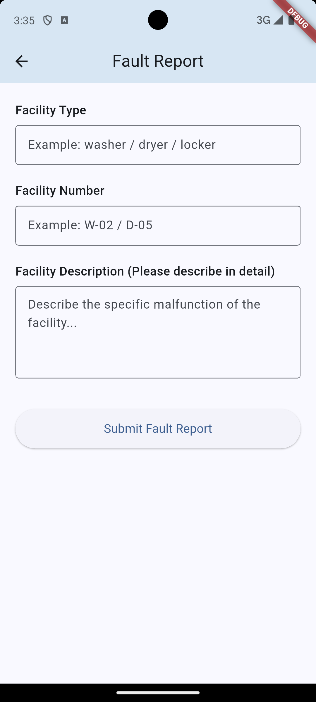

> All three fields are required, and the facility number must match the format above or submission is blocked.

---

## 12. Notifications

LaundryPulse uses push notifications (Firebase Cloud Messaging) to keep you updated, for example:

- Your wash/dry cycle has finished — time to collect.
- You've been assigned a machine from the queue.
- A machine you use has been taken out of service.

Notes:
- **Allow notification permission** when prompted at login.
- When the app is **open**, alerts appear as a banner at the top of the screen.
- Tapping a notification opens the app on the **Home** screen.

---

## 13. FAQ

**Q: Why can't I join the queue?**
Your credit score is below 15. Help with overdue laundry and get rated positively to raise it.

**Q: I tapped an available machine and nothing happened.**
Available and out-of-service tiles aren't clickable. You reserve a free machine through the **Queue** tab.

**Q: What happens if I miss my 15-minute pick-up window?**
The machine becomes **Overdue** and another user may move your clothes to a locker. You'll then be asked to rate that helper.

**Q: I tapped an overdue machine but it said it's already being assisted.**
Someone else is already helping with that machine. Nothing more is needed from you.

**Q: The heatmap says "Offline Preview".**
The weekly stats couldn't be loaded, so sample data is shown. Try again later.

**Q: Do I need to keep the app open during a cycle?**
No. The countdown runs on the backend; you'll get a notification when it finishes.

---

*For maintenance/admin operations, see the [Admin Guide](ADMIN_GUIDE.md).*
